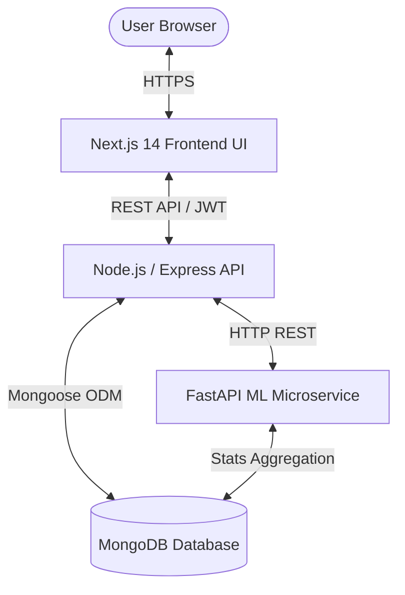

# 💳 MoneyMap — Smart Expense Monitoring System (FinFlow)

[](https://nextjs.org/)
[](https://react.dev/)
[](https://tailwindcss.com/)
[](https://nodejs.org/)
[](https://expressjs.com/)
[](https://www.mongodb.com/)
[](https://fastapi.tiangolo.com/)
[](LICENSE)

**MoneyMap (FinFlow)** is a modern full-stack intelligent financial monitoring platform built with the **MERN** stack and enhanced with a **Python Machine Learning microservice** for automated transaction categorization, anomaly detection, and spend forecasting.

---

## ✨ Features

- **📊 Intelligent Dashboard**: Real-time spending overview, monthly budget tracking, dynamic weekly trend charts, and category breakdown donut visualization.
- **🤖 AI Auto-Categorization**: Heuristic + Scikit-Learn TF-IDF classification automatically infers expense categories as you type.
- **🚨 Anomaly Detection**: Statistical Z-Score outlier detection flags unusual transactions based on rolling user spend history.
- **🌙 Persistent Dark Mode**: High-contrast theme toggle (☀️ Light / 🌙 Dark) with zero-flicker pre-hydration bootstrap and custom color palettes (`royal` & `emerald`).
- **💳 Transaction Management**: Real-time CRUD operations, instant search, category filtering, and sorting (amount, date).
- **🎯 Budget & Reports**: Visual budget progress bars, category breakdown summaries, and monthly reports.
- **🔐 Secure Authentication**: JWT-based user authentication, password hashing with bcrypt, and route guards.

---

## 🏗️ System Architecture



---

## 📁 Repository Structure

```
├── frontend/                  # Next.js 14 App Router Frontend
│   ├── app/                   # App routes (dashboard, transactions, budgets, reports, login, register)
│   ├── components/            # UI components (Navbar, StatsCards, ThemeToggle, Modal, etc.)
│   ├── lib/                   # Axios API client & interceptors
│   ├── styles/                # Tailwind & global stylesheet
│   └── tailwind.config.js     # Tailwind CSS configuration & dark mode setup
│
├── backend/                   # Node.js + Express REST API
│   ├── src/
│   │   ├── config/            # Database & environment configurations
│   │   ├── controllers/       # Auth & Expense route controllers
│   │   ├── middleware/        # JWT auth & error handling middlewares
│   │   ├── models/            # Mongoose Schemas (User, Expense, Transaction)
│   │   ├── routes/            # Express routers
│   │   ├── services/          # ML microservice HTTP client
│   │   ├── app.js             # Express application definition
│   │   └── server.js          # HTTP server bootstrap
│   └── package.json
│
├── ml-service/                # Python FastAPI Machine Learning Microservice
│   ├── app/
│   │   ├── main.py            # FastAPI endpoints (/categorize, /check-anomaly)
│   │   ├── utils.py           # NLP TF-IDF classifier & rule-based lookup
│   │   └── db.py              # Async MongoDB connection (Motor)
│   └── requirements.txt
│
└── README.md
```

---

## 🚀 Quick Start

### 1. Prerequisites
- **Node.js** v18+ & **npm**
- **Python** 3.9+ & **pip**
- **MongoDB** running locally (`mongodb://localhost:27017`) or a [MongoDB Atlas](https://www.mongodb.com/cloud/atlas) cluster URL.

---

### 2. Environment Variables Setup

#### Backend (`backend/.env`):
```env
PORT=5000
MONGO_URI=mongodb://localhost:27017/expense-tracker
JWT_SECRET=your_super_secret_jwt_key_here
```

#### Frontend (`frontend/.env.local`):
```env
NEXT_PUBLIC_API_URL=http://localhost:5000/api
NEXT_PUBLIC_ML_API_URL=http://localhost:8000/predict
```

#### ML Microservice (`ml-service/.env` or environment):
```env
MONGODB_URI=mongodb://localhost:27017/expense-tracker
PORT=8000
```

---

### 3. Installation & Running Locally

#### Step 1: Start Backend API
```bash
cd backend
npm install
npm run dev
# Running on http://localhost:5000
```

#### Step 2: Start Frontend Web App
```bash
cd frontend
npm install
npm run dev
# Running on http://localhost:3000
```

#### Step 3: (Optional) Start Python ML Service
```bash
cd ml-service
python -m venv venv
# On Windows:
.\venv\Scripts\activate
# On Linux/macOS:
# source venv/bin/activate

pip install -r requirements.txt
uvicorn app.main:app --reload --port 8000
# Running on http://localhost:8000
```

---

## 📡 API Reference

### 🔐 Authentication (`/api/auth`)
| Method | Endpoint | Description |
|---|---|---|
| `POST` | `/api/auth/register` | Register new user account (`name`, `email`, `password`) |
| `POST` | `/api/auth/login` | Log in existing user and obtain JWT token |

### 💰 Expenses (`/api/expenses`)
| Method | Endpoint | Description |
|---|---|---|
| `GET` | `/api/expenses` | Fetch user's expenses (sorted by date descending) |
| `POST` | `/api/expenses` | Create a new expense item |
| `PUT` | `/api/expenses/:id` | Update an existing expense |
| `DELETE` | `/api/expenses/:id` | Delete an expense |
| `GET` | `/api/expenses/stats` | Monthly aggregated spending stats & breakdown |

### 🧠 Python ML Service Endpoints (Port 8000)
| Method | Endpoint | Description |
|---|---|---|
| `POST` | `/categorize` | Categorize transaction via rule-engine or TF-IDF LogReg pipeline |
| `POST` | `/check-anomaly` | Compute Z-Score vs user's rolling mean/std to detect outliers |

---

## 🌐 Deployment Guide

### Deploying Frontend on Vercel
1. Import repository on [Vercel](https://vercel.com/new).
2. Set **Root Directory** to `frontend`.
3. Add Environment Variable:
   - `NEXT_PUBLIC_API_URL`: Your deployed backend URL (e.g. `https://your-api.onrender.com/api`).
4. Click **Deploy**.

### Deploying Backend & ML Service
- **Backend (Node.js)**: Deploy to [Render](https://render.com) or [Railway](https://railway.app) with root directory `backend`, start command `npm start`, and environment variables `MONGO_URI` and `JWT_SECRET`.
- **Database**: Use a free cluster on [MongoDB Atlas](https://www.mongodb.com/cloud/atlas).
- **ML Service (FastAPI)**: Deploy to Render / Railway using `uvicorn app.main:app --host 0.0.0.0 --port $PORT`.

---

## 📄 License
This project is open source and available under the [MIT License](LICENSE).
